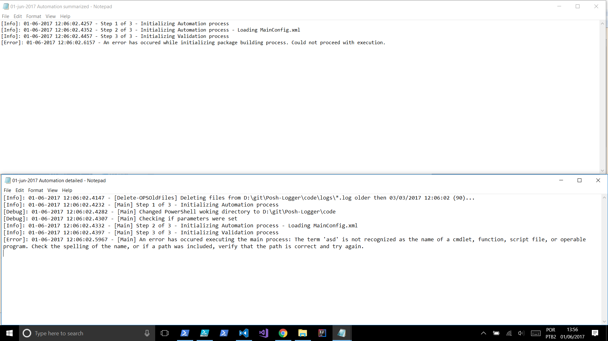

# Posh-Logger
Logging module written in Power Shell

Originalmente essa solução foi concebida para atender a necessidade de “logar” a execução de um procedimento qualquer, podendo ser importada em qualquer solução na qual o código Posh possa ser importado. A solução foi originalmente escrita num tempo vago entre um projeto e outro para manter minha mente ocupada e a skill de desenvolvimento não deixar de ser usada. Toda sua extensão foi arquitetada e escrita em quatro dias completos de trabalho, e este post é a primeira entrega da solução como um produto. 

Considerando o enorme esforço do mundo Microsoft para a integração com sistemas Linux, podemos hoje afirmar que essa solução pode ser importada em diversas plataformas e soluções nas mais variadas linguagens e arquiteturas.

Para obtê-la, é só clonar o repositório: https://github.com/ottogori/Posh-Logger.git

Junto ao código já foi escrito um extenso “how to” por meio dos comentários formalizados no “help” de cada uma das funções complexas, portanto, me conterei a demonstrar o funcionamento de seus módulos principais, sem tomar muito do texto com a explicação dos procedimentos encapsulados e/ou secundários. Esses "how to" podem ser obtidos usando a função `get-help` de cada um dos procedimentos. Um exemplo disso é mostrado abaixo:
~~~powershell
    <#Write-OPSLogInput
    .SYNOPSIS
        Writes a log input to a stream based on the log level.

    .DESCRIPTION
        This function chooses the stream to write to based on the log level parameter and writes the input to the chosen stream.

    .PARAMETER logInput
        Input to write to the stream.
        
    .PARAMETER logLevel
        Level of the log input to determine which stream to write to.
        - Info and Verbose writes to the Verbose stream.
        - Debug writes to the Debug stream
        - Warning writes to the Warning stream
        - Error writes to the Error stream
        
        This is an optional parameter. If not set, it will write to the verbose stream.
        
    .NOTES
        Author: Otto Gori
        Data: 06/2017
        testVersion: 0.0
        Should be run on systems with PS >= 3.0
        
    .INPUT EX
        Add-OPSLogInput -logInput "Initiating foobar"
        Add-OPSLogInput -logInput "Error on foobar" -logLevel Error
        
    .OUTPUTS
        Null
        
    #>
    function Write-OPSLogInput{
    [CmdletBinding()]
    param(
        [parameter(Position=0, ValueFromPipeline=$true)]
        [ValidateNotNullOrEmpty()][string]$logInput = $(throw "logInput is mandatory and was not set."),
        [ValidateSet('verbose','info','debug','warning','error')][string]$logLevel = "verbose"
    )
        process {
            switch ($logLevel) {
                warning{Write-Warning $logInput}
                error{Write-Error $logInput}
                debug{Write-Debug $logInput}
                {(($_ -eq 'verbose') -or ($_ -eq 'info'))}{Write-Verbose $logInput}
                Default{Write-Verbose $logInput}
            }
        }
    }
~~~

Dito isto, vamos à inicialização do procedimento de logging que demanda os parâmetros demonstrados abaixo e é inicializado na última linha do trecho

~~~powershell
    # Set power shell stream handling preferences
    $VerbosePreference = "Continue"
    $DebugPreference = "SilentlyContinue"
    $ErrorActionPreference = "Stop"

    # Define global variables
    $global:stepInitialize = 1
    $global:stepExecCmd = 2
    $global:stepValidate = 3
    $global:totalSteps = 3

    # Initialize log
    $global:logLevel = "Debug"   # Possible values: Error, Warning, Info and Debug
    New-OPSLogger -logPath "$PSScriptRoot\logs" -actionName 'Automation' | Out-Null
~~~

A arquitetura desta solução permite que você crie loggin com complexidades diferentes simultaneamente.

Isso se dá pela presença da possibilidade de logar em modo “debug” ou “info” que permite um log detalhado e outro que é mais simples e mais “user friendly”, podendo ser anexado em um e-mail, por exemplo, no fim da execução de um procedimento de deploy ou de preparação de um ambiente. Uma terceira possibilidade é o log em estado de erro, que além do comentário do desenvolvedor acompanhará a mensagem original de erro, permitindo um diagnóstico assertivo do problema.

O log em nível debug inclui desde o step de execução listado pelo desenvolvedor até a função na qual foi originado o erro. Já o log em nível Informativo é mais verbal, mais fácil de interpretar, podendo então ser usado para um informe de business, caso seja (em rara situação) requerido.

A solução inclui também um procedimento de rotação dos logs criados, filtrando-os por data e nome.

~~~powershell
    function Delete-OPSOldFiles {
        [CmdletBinding()]
        Param(
            [parameter(Position = 0,
                    ValueFromPipeline=$true,
                    ValueFromPipelineByPropertyName=$true
                    )][Alias('FullName')]
            [ValidateNotNullOrEmpty()][string]$path = $(throw "path is mandatory and was not set."),
            [parameter(Mandatory=$true)]
            [int]$days,
            [string]$filter = "*"
        )
        begin {
            $limit = (Get-Date).AddDays(-$days)
        }
        process {
            Add-OPSLoggerInput "Deleting files from $path\$filter older then $limit ($days)..." -logLevel Info -invocation $MyInvocation
            Get-ChildItem "$path" -filter $filter | `
                        Where-Object { -not $_.PSIsContainer -and $_.CreationTime -lt $limit } | `
                        Add-OPSLoggerInput -format "Deleting file {0}" -logLevel Debug -invocation $MyInvocation -passthru | `
                        Remove-Item
        }
    }

    #Call for this function
    Delete-OPSOldFiles -path "$PSScriptRoot\logs" -days 90 -filter *.log -ErrorAction $DebugPreference
~~~

A execução da inicialização dos arquivos de log:

~~~powershell
    <#New-OPSLogger
    .SYNOPSIS
        Create a new pair of summary and detailed log files.

    .DESCRIPTION
        Creates two new log files on $logPath directory, one for detailed log and one for summary log, following the naming convention below.
        [Current date as dd-MM-yyyy] [$actionName] detailed.log
        [Current date as dd-MM-yyyy] [$actionName] summary.log
        Examples:
            11-02-2016 AllinOne_5.0.3.5_Update detailed.log
            11-02-2016 AllinOne_5.0.3.5_Update summary.log
        
        If any of the log files already exists, it will rename the existing file with a number version at the end
        unless explicitly requesting to replace any existing file with the alwaysReplace parameter.

    .PARAMETER logPath
        Path to where the log file will be created
        
    .PARAMETER actionName
        Name of the package to use as part of the file name to identify which package processing created the log file
        
    .PARAMETER alwaysReplace
        This is a switch parameter. If set, will always replace log file if one exists with the same name.
        
    .PARAMETER alwaysReplace
        This is a switch parameter. If set, The logger object stored in $global:logger will be returned.
        
    .NOTES
        Author: Otto Gori
        Data: 06/2017
        testVersion: 0.0
        Application user must have permition to create and rename files on the directory specified by $logPath parameter
        Should be run on systems with PS >= 3.0

    .INPUT EX
        New-OPSLogger -logPath "C:\logs" -actionName "AllinOne_5.0.3.5_Update"
        New-OPSLogger -logPath "C:\logs" -actionName "AllinOne_5.0.3.5_Update" -alwaysReplace
        
    .OUTPUTS
        If passthru is set, a Dictionary with a SummaryLogFile member containg the log path, the full path to the newly created summary log file
        and a DetailedLogFile member containg the full path to the newly created detailed log file will be returned.
        The returned object is also stored in $global:logger
        If passthru is not set, the Dictionary will just be stored in $global:logger and not be returned.
        
    #>
    function New-OPSLogger{
    [CmdletBinding()]
    param(
        [ValidateNotNullOrEmpty()][string]$logPath = $(throw "logPath is mandatory and was not set."),
        [ValidateNotNullOrEmpty()][string]$actionName = $(throw "actionName is mandatory and was not set."),
        [switch]$alwaysReplace,
        [switch]$passthru
    )
        $summaryLogFile = New-OPSLogFile -logPath $logPath -actionName $actionName -logType summarized -alwaysReplace:$alwaysReplace
        $detailedLogFile = New-OPSLogFile -logPath $logPath -actionName $actionName -logType detailed -alwaysReplace:$alwaysReplace
        
        $global:logger = @{
            LogPath = $logPath
            SummaryLogFile = $summaryLogFile
            DetailedLogFile = $detailedLogFile
        }
        
        if ($passthru) {
            Write-Output $global:logger
        }
    }
~~~ 

Criará dois logs seguindo a nomenclatura padrão descrita abaixo:
    [Current date as dd-MM-yyyy] [$actionName] detailed.log
    [Current date as dd-MM-yyyy] [$actionName] summary.log
 
Examplo:
    11-02-2016 AllinOne_5.0.3.5_Update detailed.log
    11-02-2016 AllinOne_5.0.3.5_Update summary.log

Com os conteudos mostrados abaixo, onde foi incluída uma chamada da função inexistente "asd" para ilustrar o terceiro caso, erro.

Para incluir mais dados nos logs, basta usar as chamadas:
~~~powershell
Add-OPSLoggerInput -logInput "Initiating foobar" -logLevel Info -silent -invocation $MyInvocation
~~~

Ou:
~~~powershell
Add-OPSLoggerException "Error on foobar" -step "foobar" -invocation $MyInvocation
~~~
Para o caso de erro.

-

Caso você também seja um devorador de bits e queira interpretar, o código completo da solução segue abaixo:

~~~powershell
<#New-OPSLogger
.SYNOPSIS
    Create a new pair of summary and detailed log files.

.DESCRIPTION
    Creates two new log files on $logPath directory, one for detailed log and one for summary log, following the naming convention below.
    [Current date as dd-MM-yyyy] [$actionName] detailed.log
    [Current date as dd-MM-yyyy] [$actionName] summary.log
    Examples:
        11-02-2016 AllinOne_5.0.3.5_Update detailed.log
        11-02-2016 AllinOne_5.0.3.5_Update summary.log
    
    If any of the log files already exists, it will rename the existing file with a number version at the end
    unless explicitly requesting to replace any existing file with the alwaysReplace parameter.

.PARAMETER logPath
    Path to where the log file will be created
    
.PARAMETER actionName
    Name of the package to use as part of the file name to identify which package processing created the log file
    
.PARAMETER alwaysReplace
    This is a switch parameter. If set, will always replace log file if one exists with the same name.
    
.PARAMETER alwaysReplace
    This is a switch parameter. If set, The logger object stored in $global:logger will be returned.
    
.NOTES
    Author: Otto Gori
    Data: 06/2017
    testVersion: 0.0
    Application user must have permition to create and rename files on the directory specified by $logPath parameter
    Should be run on systems with PS >= 3.0

.INPUT EX
    New-OPSLogger -logPath "C:\logs" -actionName "AllinOne_5.0.3.5_Update"
    New-OPSLogger -logPath "C:\logs" -actionName "AllinOne_5.0.3.5_Update" -alwaysReplace
    
.OUTPUTS
    If passthru is set, a Dictionary with a SummaryLogFile member containg the log path, the full path to the newly created summary log file
    and a DetailedLogFile member containg the full path to the newly created detailed log file will be returned.
    The returned object is also stored in $global:logger
    If passthru is not set, the Dictionary will just be stored in $global:logger and not be returned.
    
#>
function New-OPSLogger{
[CmdletBinding()]
param(
    [ValidateNotNullOrEmpty()][string]$logPath = $(throw "logPath is mandatory and was not set."),
    [ValidateNotNullOrEmpty()][string]$actionName = $(throw "actionName is mandatory and was not set."),
    [switch]$alwaysReplace,
    [switch]$passthru
)
    $summaryLogFile = New-OPSLogFile -logPath $logPath -actionName $actionName -logType summarized -alwaysReplace:$alwaysReplace
    $detailedLogFile = New-OPSLogFile -logPath $logPath -actionName $actionName -logType detailed -alwaysReplace:$alwaysReplace
    
    $global:logger = @{
        LogPath = $logPath
        SummaryLogFile = $summaryLogFile
        DetailedLogFile = $detailedLogFile
    }
    
    if ($passthru) {
        Write-Output $global:logger
    }
}

<#Add-OPSLoggerInput
.SYNOPSIS
    Adds a log input to log files.

.DESCRIPTION
    This function formats the input adding the current date, log level and caller's function name to the input,
    adds it to the log files and optionaly writes the input to a stream according to the log level.
    
    It can add the input only to the detailed log file, only to the summary log file or to both detailed and log file
    and can also add different inputs to the summary and detailed log files.
    
    The parameter $logInput is used as the input of both detailed and summary log, with the switch parameter $summary
    indicating if the input should be added to the summary log.
    Or the parameters detailedInput and summaryInput can be used to add different inputs to each log or only one of them.

.PARAMETER logInput
    Input to write to the log files. This input will be formated using the Format-OPSLogInput function which adds
    the current date and log level to the input.
    Used in conjunction with $summary, indicates if the logInput will be written only to the detailed log or to both logs.
    
.PARAMETER logger
    Dictionary returned from New-OPSLogger containing the Full path to both detailed and summarized log files.
    
    This parameter is optional. If ommited, uses the $global:logger set by the last call to New-OPSLogger
    
.PARAMETER summaryInput
    Input to write to the summary log. This input will be formated using the Format-OPSLogInput function which adds
    the current date and log level to the input. If $logInput is set and the switch parameter $summary is also set
    this parameter will be replaced with the $logInput parameter value as the input to write to the summary log.
    
.PARAMETER detailedInput
    Input to write to the detailed log. This input will be formated using the Format-OPSLogInput function which adds
    the current date and log level to the input. If $logInput is set this parameter will be replaced with the
    $logInput parameter value as the input to write to the detailed log.
    
.PARAMETER format
    The logged information will be formated using this string replacing {0} with value from logInput.
    The output information (when $output parameter is set) will not be affected by this parameter as it passes through the input as is.
    
    This parameter is optional. If ommited, the string "{0}" will be used resulting in the logInput being logged as is.
    
.PARAMETER summaryFormat
    The logged information for the summary log will be formated using this string replacing {0} with value from logInput.
    The information is only formated if logInput is used. If summaryInput is used, the logged information will be summaryInput as is.
    This is done because summaryInput does not come from pipe and will always be a single line of string.
    So it can easily be formated prior to calling this function, which is not the case when piping the input to logInput and passing through the output without any modification.
    The output information (when $output parameter is set) will not be affected by this parameter as it passes through the input as is.
    
    This parameter is optional. If ommited, the string "{0}" will be used resulting in the logInput being logged as is.
    
.PARAMETER detailedFormat
    The logged information for the detailed log will be formated using this string replacing {0} with value from logInput.
    The information is only formated if logInput is used. If detailedInput is used, the logged information will be detailedInput as is.
    This is done because detailedInput does not come from pipe and will always be a single line of string.
    So it can easily be formated prior to calling this function, which is not the case when piping the input to logInput and passing through the output without any modification.
    The output information (when $output parameter is set) will not be affected by this parameter as it passes through the input as is.
    
    This parameter is optional. If ommited, the string "{0}" will be used resulting in the logInput being logged as is.
    
.PARAMETER logLevel
    Level of the log input. This parameter is also used to determine which stream to write to.
    - Info and Verbose writes to the Verbose stream.
    - Debug writes to the Debug stream
    - Warning writes to the Warning stream
    - Error writes to the Error stream
    
    This is an optional parameter. If not set, only the current date will be added to the input.
    
.PARAMETER invocation
    The invocation variable of the function that has the name to be put on the log input.
    The name of the function will be put only on the detailed log.
    
    This is an optional parameter.
    
.PARAMETER summary
    This is a switch parameter. It is used to indicate if the logInput parameter will be written only to the detailed log
    or to both detailed and summary log.
    
.PARAMETER passthru
    This is a switch parameter. It is used to passthru the input when piping.
    This allows adding the Add-OPSLoggerInput call in the middle of a piped instruction to log what information is being piped.
    
.PARAMETER silent
    This is a switch parameter. If set, nothing will be written to any stream.
    If ommited the input (without formating) will be sent to a stream.
    
.NOTES
    Author: Otto Gori
    Data: 06/2017
    testVersion: 0.1
    Application user must have write permition to the log file
    Should be run on systems with PS >= 3.0
    
.INPUT EX
    Add-OPSLoggerInput -logInput "Initiating foobar" -logLevel Info -silent -invocation $MyInvocation
    Add-OPSLoggerInput -logger $logger -logInput "Error on foobar" -logLevel Error -summary -invocation $MyInvocation
    Add-OPSLoggerInput -logger $logger -detailedInput "Done processing foobar with warnings" -summaryInput "Done processing foobar" -logLevel Warning
    
.OUTPUTS
    Null
    
#>
function Add-OPSLoggerInput{
[CmdletBinding()]
param(
    [parameter(Position = 0, ValueFromPipeline = $true)]$logInput,
    $logger = $global:logger,
    [string]$summaryInput,
    [string]$detailedInput,
    [string]$format,
    [string]$summaryFormat = "{0}",
    [string]$detailedFormat = "{0}",
    [string]$logLevel = "Info",
    $invocation,
    [switch]$summary,
    [switch]$passthru,
    [switch]$silent
)
    process {
        if ($format) {
            $detailedFormat = $format
            if ($summary) {
                $summaryFormat = $format
            }
        }
        
        if ($logInput) {
            $detailedInput = "$detailedFormat" -f "$logInput"
            if ($summary) {
                $summaryInput = "$summaryFormat" -f "$logInput"
            }
        }
        
        if ($logger) {
            if ($detailedInput -and $logger.DetailedLogFile) {
                $detailedFileName = $logger.DetailedLogFile
                Add-OPSLogInput -logFileName $detailedFileName -logInput $detailedInput -logLevel $logLevel -invocation $invocation -silent
            }
            
            if ($summaryInput -and $logger.SummaryLogFile) {
                $summaryFileName = $logger.SummaryLogFile
                Add-OPSLogInput -logFileName $summaryFileName -logInput $summaryInput -logLevel $logLevel -silent
            }
        }
        
        if (-not $silent) {
            if ($detailedInput) {
                Write-OPSLogInput -logInput $detailedInput -logLevel $logLevel
            }
            elseif ($summaryInput) {
                Write-OPSLogInput -logInput $summaryInput -logLevel $logLevel
            }
        }
        
        if ($passthru) {
            Write-Output $logInput
        }
    }
}

<#Add-OPSLoggerException
.SYNOPSIS
    Adds a error log input to log files and creates an object for exceptions.

.DESCRIPTION
    This function calls Add-OPSLoggerInput with log level as error, but without stoping execution.
    
    It also creates an object with details of the error that can be used by throwing it and catching on caller's function
    
    This function does not accept piping like Add-OPSLoggerInput, so it doesn't have the format parameters.
    And it always sets log level to Error, so it neither has the logLevel parameter.
    
    Besides these things, the behaviour is the same as Add-OPSLoggerInput

.PARAMETER logInput
    Input to write to the log files. This input will be formated using the Format-OPSLogInput function which adds
    the current date and log level to the input.
    Used in conjunction with $summary, indicates if the logInput will be written only to the detailed log or to both logs.
    
.PARAMETER logger
    Dictionary returned from New-OPSLogger containing the Full path to both detailed and summarized log files.
    
    This parameter is optional. If ommited, uses the $global:logger set by the last call to New-OPSLogger
    
.PARAMETER step
    Step that was being executed when the error happened. This value is added to the object returned and if thrown,
    can be retrived in the catch block with $_.TargetObject.step.
    
.PARAMETER summaryInput
    Input to write to the summary log. This input will be formated using the Format-OPSLogInput function which adds
    the current date and log level to the input. If $logInput is set and the switch parameter $summary is also set
    this parameter will be replaced with the $logInput parameter value as the input to write to the summary log.
    
.PARAMETER detailedInput
    Input to write to the detailed log. This input will be formated using the Format-OPSLogInput function which adds
    the current date and log level to the input. If $logInput is set this parameter will be replaced with the
    $logInput parameter value as the input to write to the detailed log.
    
.PARAMETER exceptionMessage
    Message to add to the object returned and if thrown can be retrived in the catch block with $_.TargetObject.message
    
    This parameter is optional. If ommited, one of the input parameters will be used following the order of which one has value
    in the order logInput, detailedInput and summaryInput
    
.PARAMETER invocation
    The invocation variable of the function that has the name to be put on the log input and on the object returned.
    The name of the function will be put only on the detailed log.
    
    This is an optional parameter.
    
.PARAMETER summary
    This is a switch parameter. It is used to indicate if the logInput parameter will be written only to the detailed log
    or to both detailed and summary log.
    
.PARAMETER silent
    This is a switch parameter. If set, nothing will be written to the error stream.
    If ommited the input will be sent to the error stream.
    
.NOTES
    Author: Otto Gori
    Data: 06/2017
    testVersion: 0.0
    Application user must have write permition to the log file
    Should be run on systems with PS >= 3.0
    
.INPUT EX
    Add-OPSLoggerException "Error on foobar" -step "foobar" -invocation $MyInvocation
    
.OUTPUTS
    Ditionary containing the keys step, message and invocation
    
#>
function Add-OPSLoggerException{
[CmdletBinding()]
param(
    [parameter(Position = 0)]$logInput,
    $logger = $global:logger,
    [ValidateNotNullOrEmpty()][string]$step = $(throw "step is mandatory and was not set."),
    [string]$summaryInput,
    [string]$detailedInput,
    [string]$exceptionMessage,
    $invocation,
    [switch]$summary,
    [switch]$silent
)
    if ($logInput) {
        $detailedInput = $logInput
        if ($summary) {
            $summaryInput = $logInput
        }
    }
    
    if (-not $exceptionMessage) {
        if ($detailedInput) {
            $exceptionMessage = $detailedInput
        } else {
            $exceptionMessage = $summaryInput
        }
    }
    
    Add-OPSLoggerInput -logger $logger -summaryInput $summaryInput -detailedInput $detailedInput `
                       -logLevel Error -invocation $invocation -summary:$summary -silent:$silent -ErrorAction "Continue"
    
    return New-OPSStepException -step $step -message $exceptionMessage -invocation $invocation
}

<#New-OPSLogFile
.SYNOPSIS
    Create new log file

.DESCRIPTION
    Creates a new log file on $logPath directory following the naming convention below.
    [Current date as dd-MM-yyyy] [$actionName] [$logType].log
    Examples:
        11-02-2016 Update detailed.log
        11-02-2016 Update summary.log
    
    If the log file already exists, it will rename the existing file with a number version at the end
    unless explicitly requesting to replace existing file with the alwaysReplace parameter.

.PARAMETER logPath
    Path to where the log file will be created
    
.PARAMETER actionName
    Name of the package to use as part of the file name to identify which package processing created the log file
    
.PARAMETER logType
    Type of the log (summary or detailed)
    
    This is an optional parameter. If not included, the log file name will be just [Current date as dd-MM-yyyy] [$actionName].log
    
.PARAMETER alwaysReplace
    This is a switch parameter. If set, will always replace log file if one exists with the same name.
    
.NOTES
    Author: Otto Gori
    Data: 06/2017
    testVersion: 0.1
    Application user must have permition to create and rename files on the directory specified by $logPath parameter
    Should be run on systems with PS >= 3.0

.INPUT EX
    New-OPSLogFile -logPath "C:\logs" -actionName "AllinOne_5.0.3.5_Update" -logType detailed
    New-OPSLogFile -logPath "C:\logs" -actionName "AllinOne_5.0.3.5_Update" -logType summary -alwaysReplace
    
.OUTPUTS
    String with the full path to the newly created log file
    
#>
function New-OPSLogFile{
[CmdletBinding()]
param(
    [ValidateNotNullOrEmpty()][string]$logPath = $(throw "logPath is mandatory and was not set."),
    [ValidateNotNullOrEmpty()][string]$actionName = $(throw "actionName is mandatory and was not set."),
    [string]$logType,
    [switch]$alwaysReplace
)
    [string]$dateString = (Get-Date -UFormat %d-%b-%Y)

    if ($logType){
        [string]$logFileName = "$dateString $actionName $logType"
    }
    else {
        [string]$logFileName = "$dateString $actionName"
    }
    [string]$logFullName = "$logFileName.log"
    
    if ($alwaysReplace) {
        Format-OPSLogInput "Creating log file at '$logPath\$logFullName' overriding if exists" | Write-Verbose
        New-Item "$logPath\$logFullName" -ItemType file -Force | Out-Null
    }
    else {
        if (Test-Path "$logPath\$logFullName") {
            Format-OPSLogInput "'$logPath\$logFullName' already exists. Attempting to rename old log file." | Write-Verbose
            Rename-OPSLastLogFile -logPath $logPath -logFileName $logFileName
        }
        
        Format-OPSLogInput "Creating log file at '$logPath\$logFullName'" | Write-Verbose
        New-Item "$logPath\$logFullName" -ItemType file -Force | Out-Null
    }
    Format-OPSLogInput "File '$logPath\$logFullName' created" | Write-Verbose
    return "$logPath\$logFullName"
}

<#Rename-OPSLastLogFile
.SYNOPSIS
    Adds a version number to the name of an old log file.

.DESCRIPTION
    Renames a log file adding a version number to keep log files from being replaced.
    It searches for all the log files that has the same name already with a version number
    and picks the next number to the maximum version number found to use as the version number.
    
    It is used by New-OPSLogFile to keep all log files for the same date, package and log type.

.PARAMETER logPath
    Path to where the log file will be created.
    
.PARAMETER logFileName
    Name of the log file without the extension.
    
.NOTES
    Author: Otto Gori
    Data: 06/2017
    testVersion: 0.0
    Application user must have permition to create and rename files on the directory specified by $logPath parameter
    Should be run on systems with PS >= 3.0

.INPUT EX
    Rename-OPSLastLogFile -logPath "C:\logs" -logFileName "11-02-2016 AllinOne_5.0.3.5_Update detailed"
    Rename-OPSLastLogFile -logPath "C:\logs" -logFileName "11-02-2016 AllinOne_5.0.3.5_Update summary"
    
.OUTPUTS
    Null
    
#>
function Rename-OPSLastLogFile{
[CmdletBinding()]
param(
    [ValidateNotNullOrEmpty()][string]$logPath = $(throw "logPath is mandatory and was not set."),
    [ValidateNotNullOrEmpty()][string]$logFileName = $(throw "logFileName is mandatory and was not set.")
)
    $files = get-childitem "$logPath\${logFileName}_*.log"
    [int]$lastFileNum = 0
    
    if ($files) {
        Format-OPSLogInput "Additional old log files for '$logFileName' found. Searching for highest number suffix." | Write-Verbose
        $filesNumMeasure = $files | Select-Object -ExpandProperty BaseName `
                                  | Select-String -pattern '\d+$' `
                                  | Select-Object -ExpandProperty matches `
                                  | Select-Object -ExpandProperty value `
                                  | ForEach-Object {[int]$_} `
                                  | Measure-Object -Maximum
        
        [int]$filesNumCount = $filesNumMeasure | Select-Object -ExpandProperty Count
        
        if ($filesNumCount -gt 0) {
            $lastFileNum = $filesNumMeasure | Select-Object -ExpandProperty Maximum
        }
        
        Format-OPSLogInput "Highest number suffix found for '$logFileName' is $lastFileNum" | Write-Verbose
    }
    
    [int]$nextFileNum = $lastFileNum + 1
    
    [string]$oldFileName = "$logPath\$logFileName.log"
    [string]$newFileName = "${logFileName}_$nextFileNum.log"
    
    Format-OPSLogInput "Attepting to rename log file '$oldFileName' to '$newFileName'" | Write-Verbose
    Rename-Item $oldFileName $newFileName -Force
    Format-OPSLogInput "Succeeded renaming log file '$oldFileName' to '$newFileName'" | Write-Verbose
}

<#Format-OPSLogInput
.SYNOPSIS
    Formats a log input

.DESCRIPTION
    Formats the input of a log by adding to the input the current date and optionaly the log level and function name.

.PARAMETER logInput
    Log input that will be formated.
    
.PARAMETER logLevel
    Level of the log input.
    
    This is an optional parameter.
    
.PARAMETER invocation
    The invocation variable of the function that has the name to be put on the log input.
    
    This is an optional parameter.
    
.NOTES
    Author: Otto Gori
    Data: 06/2017
    testVersion: 0.0
    
.INPUT EX
    Format-OPSLogInput -logInput "Initiating foobar"
    Format-OPSLogInput -logInput "Error on foobar" -logLevel Error -invocation $MyInvocation
    
.OUTPUTS
    String with the formated log input.
    
#>
function Format-OPSLogInput{
[CmdletBinding()]
param(
    [parameter(Position=0, ValueFromPipeline=$true)]
    [ValidateNotNullOrEmpty()][string]$logInput = $(throw "logInput is mandatory and was not set."),
    [string]$logLevel,
    $invocation
)
    process {
        $dateTime = Get-Date -Format "dd-MM-yyyy HH:mm:ss.ffff"
        
        if ($invocation) {
            $functionName = $invocation.MyCommand.Name
            $formatedInput = "$dateTime - [$functionName] $logInput"
        }
        else {
            $formatedInput = "$dateTime - $logInput"
        }
        
        if ($logLevel) {
            return "[$logLevel]: $formatedInput"
        }
        else {
            return "$formatedInput"
        }
    }
}

<#Add-OPSLogInput
.SYNOPSIS
    Adds a log input to a log file.

.DESCRIPTION
    This function formats the input adding the current date and log level to the input, adds it to the log file
    and optionaly writes the input to a stream according to the log level.

.PARAMETER logFileName
    Full path to the log's file.
    
.PARAMETER logInput
    Input to write to the log. This input will be formated using the Format-OPSLogInput function which adds
    the current date and log level to the input.
    
.PARAMETER logLevel
    Level of the log input. This parameter is also used to determine which stream to write to.
    - Info and Verbose writes to the Verbose stream.
    - Debug writes to the Debug stream
    - Warning writes to the Warning stream
    - Error writes to the Error stream
    
    This is an optional parameter. If not set, only the current date will be added to the input.
    
.PARAMETER invocation
    The invocation variable of the function that has the name to be put on the log input.
    
    This is an optional parameter.
    
.PARAMETER silent
    This is a switch parameter. If set, nothing will be written to any stream.
    If omitted the input (without formating) will be sent to a stream.
    
.NOTES
    Author: Otto Gori
    Data: 06/2017
    testVersion: 0.1
    Application user must have write permition to the log file
    Should be run on systems with PS >= 3.0
    
.INPUT EX
    Add-OPSLogInput -logFileName "C:\logs\11-02-2016 AllinOne_5.0.3.5_Update detailed" -logInput "Initiating foobar" -logLevel Info -silent
    Add-OPSLogInput -logFileName "C:\logs\11-02-2016 AllinOne_5.0.3.5_Update summary" -logInput "Error on foobar" -logLevel Error -invocation $MyInvocation
    
.OUTPUTS
    Null
    
#>
function Add-OPSLogInput{
[CmdletBinding()]
param(
    [parameter(Position=0, ValueFromPipeline=$true)]
    [ValidateNotNullOrEmpty()][string]$logInput = $(throw "logInput is mandatory and was not set."),
    [ValidateNotNullOrEmpty()][string]$logFileName = $(throw "logFileName is mandatory and was not set."),
    [string]$logLevel = "Info",
    $invocation,
    [switch]$silent
)
    begin {
        $globalLevelNum = Convert-OPSLogLevel $global:logLevel
        $levelNum = Convert-OPSLogLevel $logLevel
    }
    process {        
        if ($levelNum -ge $globalLevelNum) {
            [string]$formatedInput = Format-OPSLogInput -logInput $logInput -logLevel $logLevel -invocation $invocation
            Add-Content $logFileName "$formatedInput"
        }        
        if (-not $silent) {
            Write-OPSLogInput -logInput $logInput -logLevel $logLevel
        }
    }
}

<#Write-OPSLogInput
.SYNOPSIS
    Writes a log input to a stream based on the log level.

.DESCRIPTION
    This function chooses the stream to write to based on the log level parameter and writes the input to the chosen stream.

.PARAMETER logInput
    Input to write to the stream.
    
.PARAMETER logLevel
    Level of the log input to determine which stream to write to.
    - Info and Verbose writes to the Verbose stream.
    - Debug writes to the Debug stream
    - Warning writes to the Warning stream
    - Error writes to the Error stream
    
    This is an optional parameter. If not set, it will write to the verbose stream.
    
.NOTES
    Author: Otto Gori
    Data: 06/2017
    testVersion: 0.0
    Should be run on systems with PS >= 3.0
    
.INPUT EX
    Add-OPSLogInput -logInput "Initiating foobar"
    Add-OPSLogInput -logInput "Error on foobar" -logLevel Error
    
.OUTPUTS
    Null
    
#>
function Write-OPSLogInput{
[CmdletBinding()]
param(
    [parameter(Position=0, ValueFromPipeline=$true)]
    [ValidateNotNullOrEmpty()][string]$logInput = $(throw "logInput is mandatory and was not set."),
    [ValidateSet('verbose','info','debug','warning','error')][string]$logLevel = "verbose"
)
    process {
        switch ($logLevel) {
            warning{Write-Warning $logInput}
            error{Write-Error $logInput}
            debug{Write-Debug $logInput}
            {(($_ -eq 'verbose') -or ($_ -eq 'info'))}{Write-Verbose $logInput}
            Default{Write-Verbose $logInput}
        }
    }
}

<#Convert-OPSLogLevel
.SYNOPSIS
    Converts a string log level into a numeric log level.

.DESCRIPTION
    Converts the strings for log levels (Error, Warning, Info, Verbose and Debug) into numeric representation
    to facilitate in log level calculations to determine whether a log input should be logged.

.PARAMETER logLevel
    Level to convert. The conversions are as follows
    - Error: 3
    - Warning: 2
    - Info and Verbose: 1
    - Debug: 0
    
.NOTES
    Author: Otto Gori
    Data: 06/2017
    testVersion: 0.0
    
.INPUT EX
    Convert-OPSLogLevel Error
    Convert-OPSLogLevel -logLevel Debug
    
.OUTPUTS
    Numeric representation of the log level.
    
#>
function Convert-OPSLogLevel {
[CmdletBinding()]
param(
    [parameter(Position=0, ValueFromPipeline=$true)]
    [ValidateSet('verbose','info','debug','warning','error')][string]$logLevel = $(throw "logLevel is mandatory and was not set.")
)
    process{
        switch ($logLevel) {
            debug{return 0}
            {(($_ -eq 'verbose') -or ($_ -eq 'info'))}{return 1}
            warning{return 2}
            error{return 3}
            Default{return 0}
        }
    }
}

function New-OPSDirectory {
    [CmdletBinding()]
    Param(
        [parameter(Position = 0,
                   ValueFromPipeline=$true,
                   ValueFromPipelineByPropertyName=$true
                   )][Alias('FullName')]
        [ValidateNotNullOrEmpty()][string]$path = $(throw "path is mandatory and was not set."),
        [switch]$ignoreIfExists
    )
    process {
        if (-not $ignoreIfExists -or -not (test-path $path)) {
            New-Item -path $path -ItemType Directory
            Add-OPSLoggerInput "Directory $path created" -logLevel Debug -invocation $MyInvocation
        }
        else {
            $directory = Get-Item -path $path
            if ($directory.PSIsContainer) {
                Add-OPSLoggerInput "Directory $path already existed. Returned existing directory" -logLevel Debug -invocation $MyInvocation
                return $directory
            }
            else {
                throw [System.Exception] "Could not create directory $path because a file with this name already exists"
            }
        }
    }
}

function Delete-OPSOldFiles {
    [CmdletBinding()]
    Param(
        [parameter(Position = 0,
                   ValueFromPipeline=$true,
                   ValueFromPipelineByPropertyName=$true
                   )][Alias('FullName')]
        [ValidateNotNullOrEmpty()][string]$path = $(throw "path is mandatory and was not set."),
        [parameter(Mandatory=$true)]
        [int]$days,
        [string]$filter = "*"
    )
    begin {
        $limit = (Get-Date).AddDays(-$days)
    }
    process {
        Add-OPSLoggerInput "Deleting files from $path\$filter older then $limit ($days)..." -logLevel Info -invocation $MyInvocation
        Get-ChildItem "$path" -filter $filter | `
                      Where-Object { -not $_.PSIsContainer -and $_.CreationTime -lt $limit } | `
                      Add-OPSLoggerInput -format "Deleting file {0}" -logLevel Debug -invocation $MyInvocation -passthru | `
                      Remove-Item
    }
}

function New-OPSStepException{
[CmdletBinding()]
param(
    [ValidateNotNullOrEmpty()][string]$step = $(throw "step is mandatory and was not set."),
    [ValidateNotNullOrEmpty()][string]$message = $(throw "message is mandatory and was not set."),
    $invocation = $(throw "invocation is mandatory and was not set.")
)
    return @{
        step = $step
        message = $message
        invocation = $invocation
    }
}

~~~

Ficou alguma dúvida ou tem alguma observação a fazer? Aproveite os campos abaixo. Até a próxima!

--

Tem a cultura DevOps e gostaria de fazer parte de um time incrível? Clique aqui. [www.concrete.com.br/vagas]
